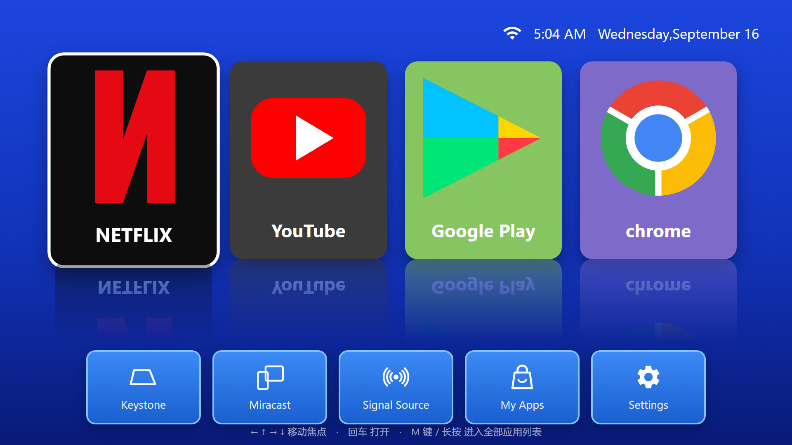

# Android TV

这是一个适用于 Android TV、电视盒子和投影仪的桌面启动器。主界面提供四张应用卡片和五个常用入口，支持遥控器方向键、确认键、菜单键和长按操作。



浏览器中可以打开 [`docs/demo.html`](docs/demo.html) 查看交互示例。示例页面支持方向键移动焦点、回车打开，以及按 `M` 键进入全部应用列表。

## 项目信息

- 参考链接：[Android TV 开发文档](https://developer.android.com/tv)
- 使用版本：Android TV SDK API 33

## 使用方法

- 使用方向键在卡片和底栏之间移动。
- 按确认键打开应用或系统功能。
- 长按卡片或底栏按钮，可以为当前位置绑定其他已安装应用。
- 按遥控器菜单键，或选择 `My Apps`，可以查看全部应用。
- 已经绑定的按钮可以重新选择应用，也可以恢复默认设置。

应用绑定保存在本机。绑定完成后，桌面会显示对应应用的名称和图标，主卡片的颜色也会根据应用图标调整。

## 默认应用

桌面会按照下表中的顺序查找已安装应用。找到可用包名后直接启动；如果没有安装，则可以选择本机其他应用，或前往应用商店。

| 卡片 | 包名 |
| --- | --- |
| Netflix | `com.netflix.ninja`、`com.netflix.mediaclient` |
| YouTube | `com.google.android.youtube.tv`、`com.google.android.youtube`、`com.google.android.apps.youtube.tv`、`com.google.android.apps.youtube.mango` |
| Google Play | `com.android.vending`、`com.google.android.apps.play.tv` |
| Chrome | `com.android.chrome`、`com.chrome.beta`、`com.android.browser` |

需要调整默认应用时，修改 [`TileSpec.kt`](app/src/main/java/com/liusheng/tvlauncher/data/TileSpec.kt) 中的包名即可。

## 底栏功能

底栏包含梯形校正、无线投屏、信号源、全部应用和系统设置。

梯形校正、无线投屏和信号源通常由设备厂商实现，不同机型使用的 Intent 可能不同。相关候选入口集中在 [`TileSpec.kt`](app/src/main/java/com/liusheng/tvlauncher/data/TileSpec.kt) 的 `DockItems` 中。接入新设备时，可以把该机型提供的 Intent 放到候选列表前面。

顶部状态栏会显示时间、日期、Wi-Fi 信号和 USB 连接状态。USB 图标跟随系统连接状态变化，只要系统检测到 USB 连接就会点亮。

## 工程结构

```text
app/src/main/java/com/liusheng/tvlauncher/
├── MainActivity.kt          桌面界面和系统状态
├── AppListActivity.kt       已安装应用列表
├── data/
│   ├── AppEntry.kt          应用信息
│   ├── PackageGateway.kt    应用查询和启动
│   ├── TileSpec.kt          卡片与底栏配置
│   └── TileStore.kt         应用绑定存储
└── ui/
    ├── AppListAdapter.kt    应用列表适配器
    ├── ColorUtils.kt        卡片颜色提取
    ├── FocusEffect.kt       焦点和按压动画
    ├── LayoutMetrics.kt     屏幕尺寸适配
    └── ReflectionLayout.kt  卡片倒影
```

项目使用 Kotlin 和 Android View 构建，没有引入额外的界面框架。图片资源位于 `app/src/main/res/drawable`，界面布局位于 `app/src/main/res/layout`。

## 编译

需要准备：

- JDK 17 或更高版本
- Android SDK 35
- Android Build Tools 35.0.0

在项目根目录创建 `local.properties`，填写本机 Android SDK 路径：

```properties
sdk.dir=D\:\\android\\sdk
```

Windows：

```powershell
.\gradlew.bat assembleDebug
```

macOS 或 Linux：

```bash
./gradlew assembleDebug
```

生成的 APK 位于：

```text
app/build/outputs/apk/debug/app-debug.apk
```

安装到设备：

```bash
adb install -r app/build/outputs/apk/debug/app-debug.apk
```

## 设为默认桌面

安装完成后，可以在设备的“默认应用”或“主屏幕应用”设置中选择 Android TV。也可以通过 ADB 设置：

```bash
adb shell cmd package set-home-activity com.liusheng.tvlauncher/.MainActivity
```

应用同时保留普通启动入口，因此不设为默认桌面也可以直接运行。连续按两次返回键可以退出。

## 权限

- `QUERY_ALL_PACKAGES`：读取设备上可启动的应用，用于全部应用列表和卡片绑定。
- `ACCESS_NETWORK_STATE`：读取当前网络连接状态。
- `ACCESS_WIFI_STATE`：读取 Wi-Fi 状态和信号强度。

如果准备发布到 Google Play，需要根据实际上架方式评估 `QUERY_ALL_PACKAGES` 的使用要求，也可以改为通过 `<queries>` 声明需要查询的应用。

## License

MIT

